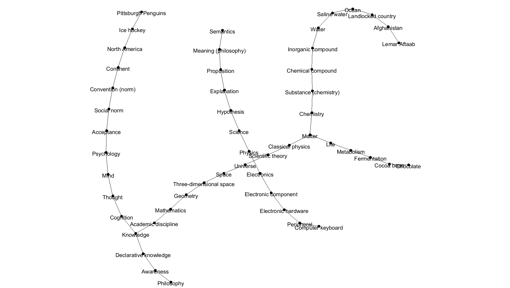

# Wikipedia Crawler

This project was created as the final deliverable for NETS 1500: 
Networks and Social System Engineering. This project uses JSoup and Swing to test and visualize the [Wikipedia
Philosophy Phenomenon](https://en.wikipedia.org/wiki/Wikipedia:Getting_to_Philosophy),
which states:
>Following the first hyperlink in the main text of an
English Wikipedia article, and then repeating the process for subsequent
articles, usually leads to the Philosophy article.

This shows that given four starting seeds (Pittsburgh Penguins, Lemar Aftaab,
Computer Keyboard, Semantics), we are able to follow the phenomenon's search logic
to reach the Wikipedia Philosophy page.